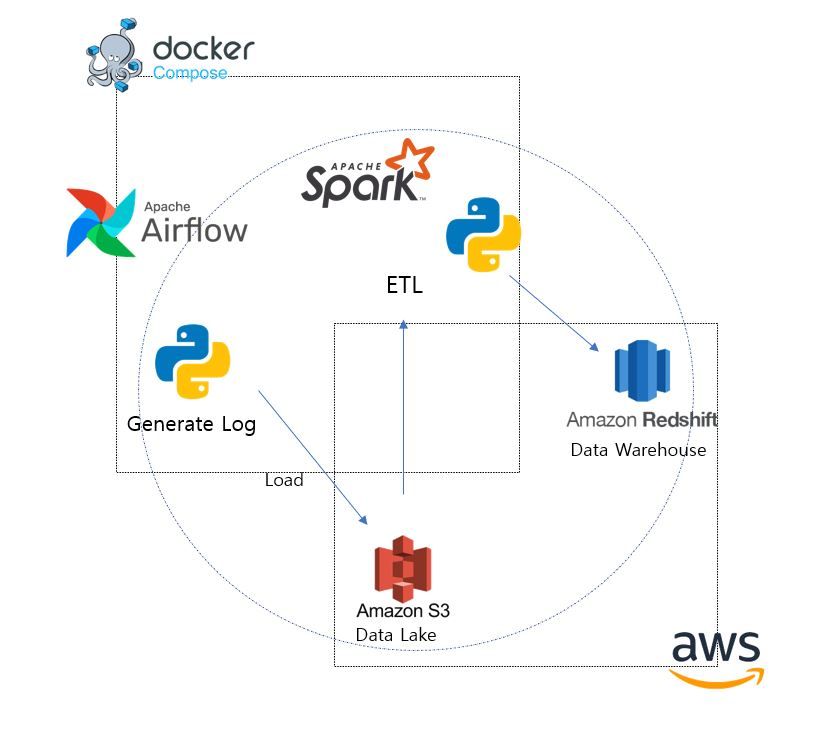

# My Data Pipeline Project
데이터 파이프라인을 직접 구축해보는 프로젝트입니다.

날마다 갱신되는 웹 서버 액세스 로그를 가져오는 상황을 가정하고 데이터 파이프라인을 작성합니다.

회사에서 웹 서버를 운영 중이고 액세스 로그를 매일 다른 파일에 저장하게끔 관리한다고 가정합니다. 



**주요 하위 프로젝트**
- [ETL](https://github.com/yangju0411/etl_dw)

## 주요 목표
1. Airflow를 통한 스케줄링
2. 데이터 레이크 AWS S3 (완료)
3. 데이터웨어하우스 AWS Redshift
4. ETL 작업은 Spark

## 데이터 소스
데이터 소스는 직접 제작한 [로그 생성기](https://github.com/yangju0411/log_generator) 파이썬 라이브러리를 통해 제작합니다.

```
{ip_address} - - {date} "{method} {path}" {status} {size} "{user_agent}"
...
```
데이터는 위와 같은 형태로 생성됩니다. 한 줄에 요청이 하나입니다.

본 프로젝트는 하루에 한 번 쌓여 있는 하루치 로그를 일괄로 처리하여 DW에 적재하는 상황을 가정하기 때문에 하루치 로그를 생성하여 하나의 파일로 저장합니다.

## 스케줄러
매번 쌓이는 로그를 실시간으로 처리하는 것이 아닌 데이터를 일괄 처리(batch processing)하는 작업이기 때문에 배치 작업에 적합한 워크플로우인 Airflow를 선택하였습니다. 

그리하여 Airflow를 통해 데이터 파이프라인의 워크플로우를 관리합니다. Airflow의 메타데이터 DB로는 PostgreSQL을 사용합니다. 메시지 큐로 Redis를 두어 분산 처리가 가능한 CeleryExecutor를 사용합니다. 그러나 실제 worker는 도커 컨테이너 하나 뿐입니다.


## Data Lake
AWS S3에 생성한 로우 데이터를 적재합니다. 

## ETL
ETL 과정의 코드와 DW 설계는 [ETL_DW](https://github.com/yangju0411/etl_dw) 프로젝트에 기반합니다. <br>
테이블 설계에 대한 자세한 내용은 해당 [디렉토리](query/) 참조

### DW
S3에서 로우 데이터를 가져와 처리 후 데이터 웨어하우스(AWS Redshift)에 적재합니다. 
Redshift는 PostgreSQL 기반의 데이터웨어하우스 시스템입니다.<br>
일반적인 RDBMS와 다르게 열지향 MPP 데이터베이스로 데이터웨어하우스를 구성하는데 장점을 가지기 때문에 하위 프로젝트에서 쓰던 Postgre에서 Redshift로 데이터 웨어하우스를 변경하였습니다.<br>
SQL 쿼리가 상당 부분 호환되며 더 대용량의 데이터를 처리하기에 적합하고 컬럼 지향이기 때문에 컬럼 자체의 카디널리티가 작은 DW에서 성능 향상을 기대할 수 있습니다.


## 관련 디렉토리
- [dags](/docker_airflow/dags/)
- [docker-airflow](/docker_airflow/)
- [docker-postgre](/docker_postgre/)

# References
참고하는 모든 유용한 링크들을 모아놓습니다.

## Data Pipeline
[Simple Data Pipeline Project](https://github.com/yansfil/grab-data-world)

[Pubg-ETL-Pipeline](https://github.com/danielgyu/Pubg-ETL-Pipeline)

[ETL-Pipeline](https://github.com/renatootescu/ETL-pipeline)

## DB
[타다 (TADA) 서비스의 데이터 웨어하우스 : 태초부터 현재까지](https://speakerdeck.com/vcnc/tada-tada-seobiseuyi-deiteo-weeohauseu-taecobuteo-hyeonjaeggaji?slide=29)

[웹로그 분석을 위한 데이터 웨어하우스 시스템 구축](http://koreascience.kr/article/CFKO201035751420664.page?&lang=ko)

팩트 테이블 - 빅데이터를 지탱하는 기술 p.80, p.119

[SQLite vs MySQL vs PostgreSql: 관계형 DB 시스템의 비교](https://smoh.tistory.com/370)

## DW
[Getting started with AWS Redshift](https://docs.aws.amazon.com/redshift/latest/gsg/getting-started.html)

[타다 (TADA) 서비스의 데이터 웨어하우스 : 태초부터 현재까지](https://speakerdeck.com/vcnc/tada-tada-seobiseuyi-deiteo-weeohauseu-taecobuteo-hyeonjaeggaji?slide=29)

[웹로그 분석을 위한 데이터 웨어하우스 시스템 구축](http://koreascience.kr/article/CFKO201035751420664.page?&lang=ko)

[데이터웨어 하우스의 차원 데이터 모델 – 예제가 포함 된 자습서](https://ko.myservername.com/dimensional-data-model-data-warehouse-tutorial-with-examples)

팩트 테이블 - 빅데이터를 지탱하는 기술 p.80, p.119

[데이터 웨어하우스 모델링 기본 개념 잡기 1편(Fact, Dimension 테이블)](https://datalibrary.tistory.com/43)

[스타 스키마와 눈송이 스키마.](https://snowturtle93.github.io/posts/%EC%8A%A4%ED%83%80-%EC%8A%A4%ED%82%A4%EB%A7%88%EC%99%80-%EB%88%88%EC%86%A1%EC%9D%B4-%EC%8A%A4%ED%82%A4%EB%A7%88/)

[데이터웨어 하우스 모델링의 스키마 유형](https://ko.myservername.com/schema-types-data-warehouse-modeling-star-snowflake-schema)

[AWS Redshift](https://mktg-apac.s3-ap-southeast-1.amazonaws.com/AWS+Summit+Online+Korea/Track5_Session5_Data+Lake+%ED%99%98%EA%B2%BD%EC%97%90%EC%84%9C+Amazon+Redshift+Spectrum%EC%9D%84+%EC%9D%B4%EC%9A%A9%ED%95%9C+%EB%8C%80%EB%9F%89+%EB%8D%B0%EC%9D%B4%ED%84%B0+%ED%99%9C%EC%9A%A9+-+%EC%8A%A4%EB%A7%88%ED%8A%B8%ED%8C%A9%ED%86%A0%EB%A6%AC+%EC%9B%A8%EC%96%B4%ED%95%98%EC%9A%B0%EC%8A%A4+%EA%B5%AC%EC%B6%95+%EC%82%AC%EB%A1%80+%EC%86%8C%EA%B0%9C.pdf)

[오픈소스 그린플럼 소개](http://www.itdaily.kr/news/articleView.html?idxno=89798)

[[AWS] Redshift의 특징들](https://jaemunbro.medium.com/aws-redshift-%EA%B8%B0%EC%B4%88%EC%A7%80%EC%8B%9D-987aedcb2830)

[Redshift serverless 공식 문서](https://docs.aws.amazon.com/redshift/latest/mgmt/serverless-connecting.html)

[Redshift 데이터베이스 개발자 안내서](https://docs.aws.amazon.com/ko_kr/redshift/latest/dg/r_CREATE_TABLE_NEW.html)

[Redshift 열 압축](https://tkwon.tistory.com/2?category=1012291)

[Redshift 열 압축 예제](https://docs.aws.amazon.com/ko_kr/redshift/latest/dg/Examples__compression_encodings_in_CREATE_TABLE_statements.html)
## Airflow
[Apache 공식 문서 Running Airflow in Docker](https://airflow.apache.org/docs/apache-airflow/stable/start/docker.html)

[AirFlow Manual on Docker](https://dorumugs.tistory.com/entry/AirFlow-Manual-on-Docker-stage-install)

[Airflow 시작하기](https://lsjsj92.tistory.com/631)

[Data Pipeline with Apache Airflow](https://github.com/K9Ns/data-pipelines-with-apache-airflow)

[Airflow dag내에서 모듈 사용](https://myohyun.tistory.com/318)

시스템 간 데이터 이동하기 - Data Pipelines with Apache Airflow p.155

[Airflow, S3 Connection](https://hevodata.com/learn/airflow-s3-connection/)